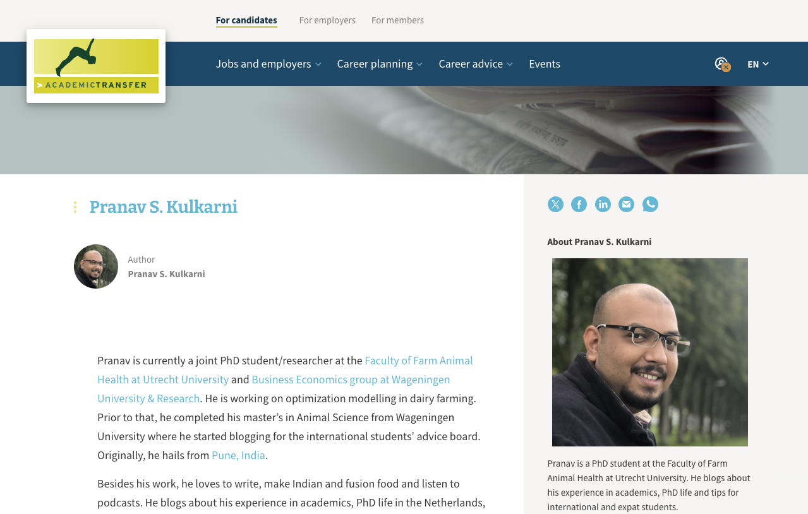

<br><br>

:::::::::::::: {.columns}

::: {.column width="40%"}

```{r image-prof, echo = FALSE, message=FALSE, fig.align='left'}

```

<br> <br> 

## Contact Form

Please fill out the form below for contacting.

<form id="contactForm">
  <label for="name">Your Name:</label><br>
  <input type="text" id="name" name="name" required><br><br>

  <label for="email">Your Email:</label><br>
  <input type="email" id="email" name="email" required><br><br>

  <label for="message">Your Message:</label><br>
  <textarea id="message" name="message" rows="4" cols="30" required></textarea><br><br>

  <input type="submit" value="Send Message">
</form>

<p id="statusMessage"></p>

<script>
  // JavaScript to handle form submission
  document.getElementById("contactForm").onsubmit = function(event) {
    event.preventDefault();  // Prevent the form from actually submitting

  // Show the spoof failure message
  document.getElementById("statusMessage").innerHTML = "Error! Contact attempt failed. If the problem persists,      email at {email}";
  };
</script>

:::

::: {.column width="60%"}

## Pranav S. Kulkarni
### BVSc& AH, MSc, PhD

<br> <br> 

I am Dr. Pranav S. Kulkarni, a veterinary epidemiologist focusing on the intersection of animal health, human health, and the environment. Currently, as a postdoctoral researcher at the University of California, Davis, I study climate-driven risks of zoonotic spillover, specifically the spread of New World Arenaviruses, as part of the Wellcome Trust-funded Atlas Arena project. With a joint-PhD from Wageningen University and Utrecht University, my work spans epidemiology, biostatistics, and policy. I specialize in advanced statistical techniques, machine learning, and spatial tools, using data-driven insights to address infectious disease and livestock management challenges. My research bridges veterinary science with ecology and global health, aiming to create more resilient, evidence-based approaches to disease prevention.Let’s connect to discuss these exciting intersections of science, policy, and health.

<br> <br> 

## Blog

[](https://www.academictransfer.com/en/blog/author/pranav-s-kulkarni/)

:::

:::::::::::::: {.columns}
